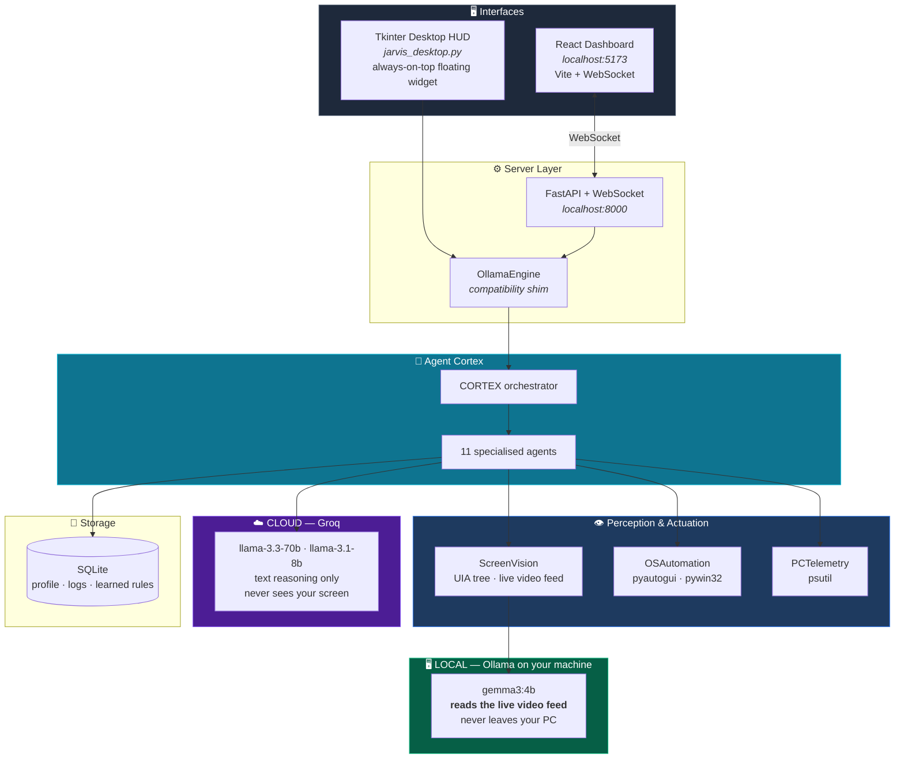
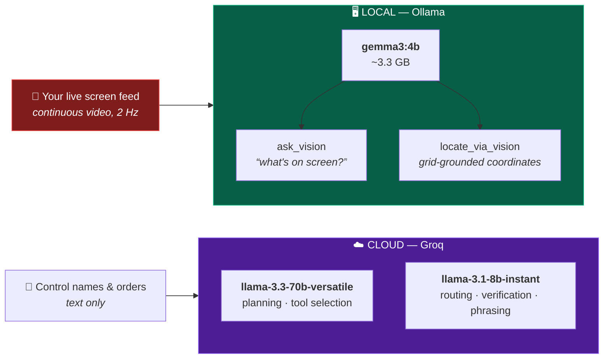
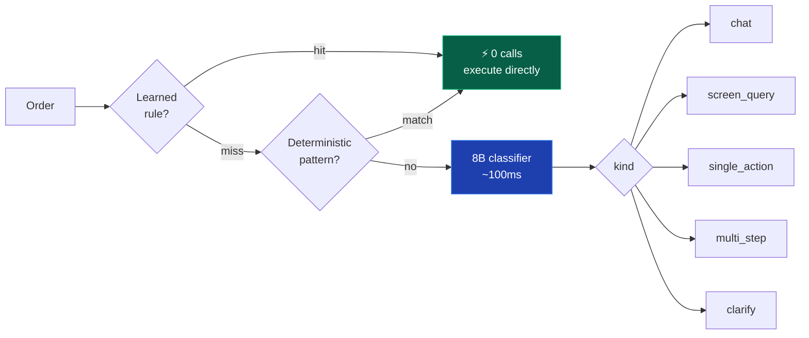
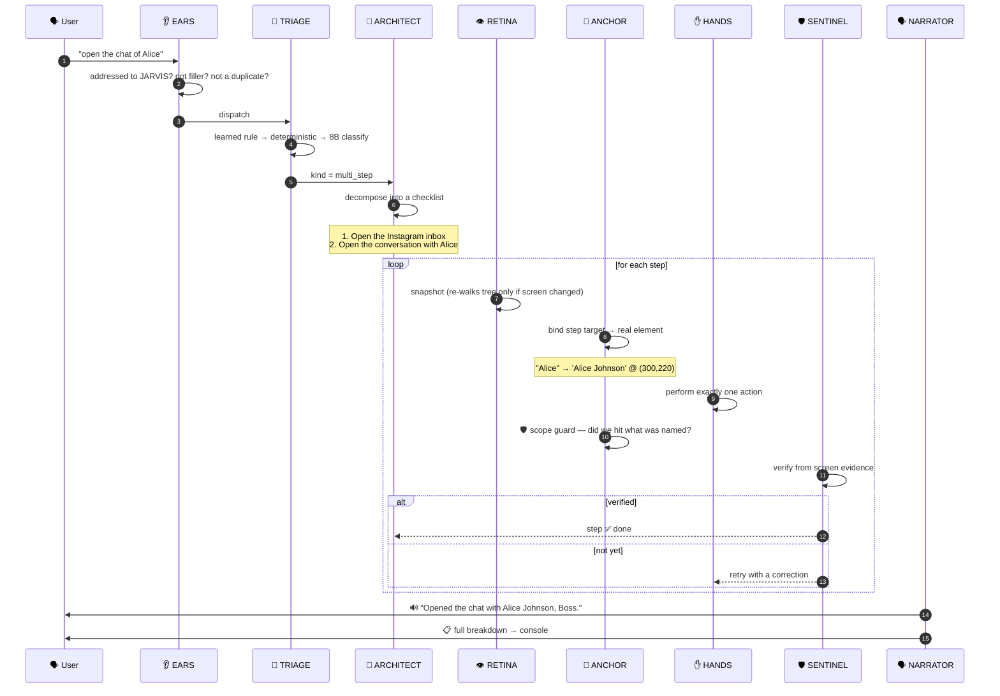
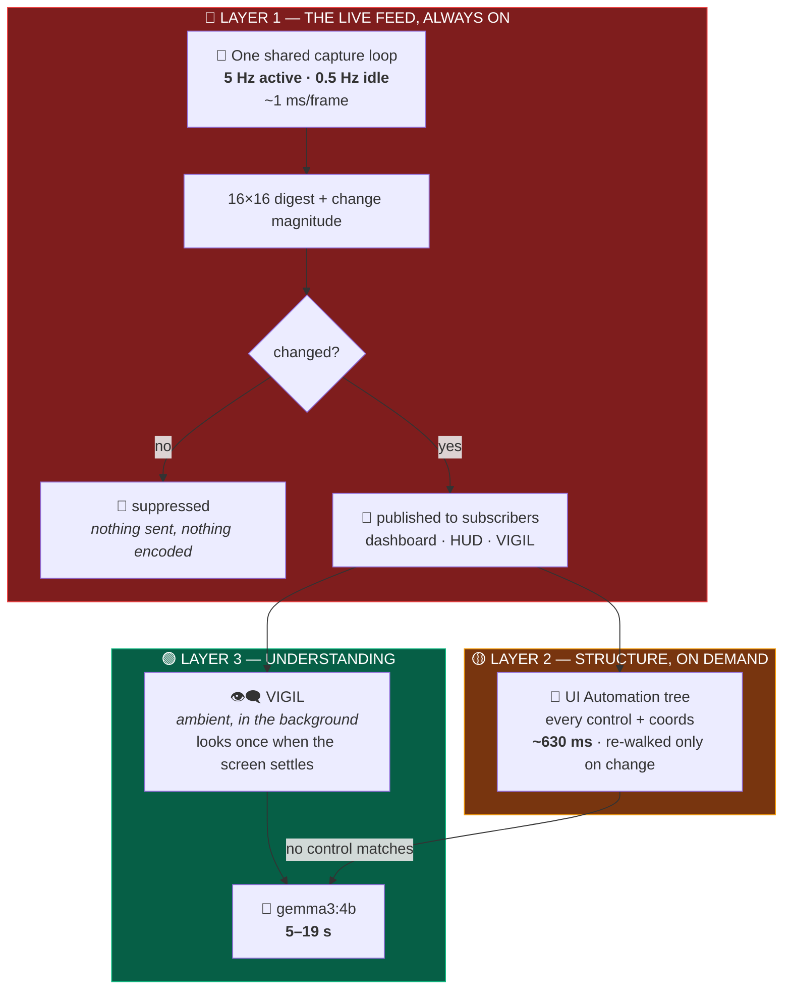
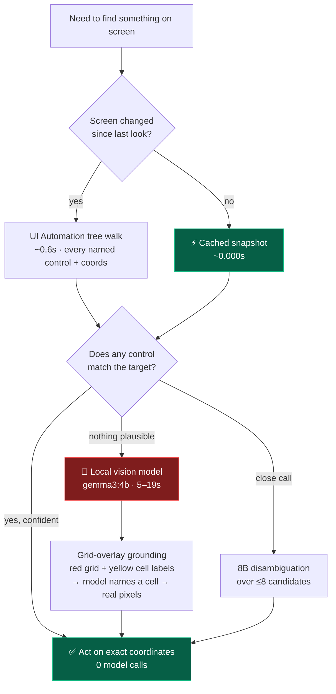
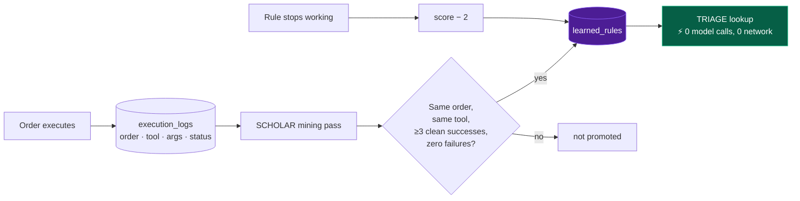

<div align="center">

# 🧠 JARVIS 2.0

### An autonomous desktop agent that *sees* your screen and *uses* your computer.

Not a chatbot with a plugin list — a hands-on operator that perceives the live Windows UI,
decides one action at a time, clicks and types like a human, and verifies its own work.

<br>


<br>


</div>

---

## 📖 Table of Contents

- [What Is This?](#-what-is-this)
- [Capabilities](#-capabilities)
- [System Architecture](#-system-architecture)
- [The Model Stack](#-the-model-stack)
- [The Agent Cortex](#-the-agent-cortex)
- [How an Order Flows](#-how-an-order-flows)
- [How JARVIS Sees](#-how-jarvis-sees)
- [VIGIL — Instant Screen Answers](#️-vigil--why-whats-on-my-screen-is-instant)
- [How JARVIS Learns](#-how-jarvis-learns)
- [Tech Stack](#-tech-stack)
- [Project Structure](#-project-structure)
- [Getting Started](#-getting-started)
- [The Two Interfaces](#-the-two-interfaces)
- [API Reference](#-api-reference)
- [Configuration](#-configuration)
- [Benchmarks](#-benchmarks)
- [Testing](#-testing)
- [Known Limitations](#-known-limitations)
- [Roadmap](#-roadmap)

---

## 🎯 What Is This?

Most "AI assistants" are text boxes that call APIs. JARVIS is different: it reads the **live Windows
accessibility tree**, watches a **live video feed of your screen** through a **locally-run vision model**, and
drives your **real mouse and keyboard**.

> 🔒 **Your screen stays yours.** The whole video feed is read on your machine via Ollama
> (`gemma3:4b`). Not one frame is ever uploaded. See [The Model Stack](#-the-model-stack).

Say *"open Instagram and message Alice"* and it will launch the inbox, visually locate that
specific conversation among dozens, click it, and type — checking after every step that the screen
actually changed the way it expected.

```
┌─ You ──────────────────────────────────────────────────────────┐
│  "open the chat of Alice"                                      │
└────────────────────────────────────────────────────────────────┘
                              ↓
┌─ JARVIS ───────────────────────────────────────────────────────┐
│  Intent: multi_step (via rule)                        0 calls  │
│  Plan: 1. Open the Instagram inbox                             │
│        2. Open the conversation with Alice                     │
│  ANCHOR: "Alice" → 'Alice Johnson' (exact, 1.00)               │
│  HANDS:  click (300, 220)                                      │
│  SENTINEL: verified — 'Alice Johnson' is now on screen         │
│  → "Opened the chat with Alice Johnson, Boss."                 │
└────────────────────────────────────────────────────────────────┘
```

### Why it's built as agents

The original engine was one big ReAct loop that carried all 21 tool schemas, intent routing,
execution, completion-judging and phrasing on **every single step**. It paid for all of them every
time: ~2,000 tokens of tool schemas per call, a full UI-Automation tree walk per step, and a second
70B model call after every action just to ask *"are we done yet?"*

A three-action task cost roughly **six 70B round-trips**.

JARVIS 2.0 splits that work across **12 specialised agents**, each with one job and a small prompt.
Most orders now resolve with **zero model calls at all**.

---

## ⚡ Capabilities

<table>
<tr>
<td width="50%" valign="top">

### 🖱️ Desktop Control
- Launch apps, switch windows, close tabs
- Click any control by name, ordinal, or description
- Type into focused inputs
- Keyboard shortcuts, scrolling, hover
- Open social inboxes (Instagram / WhatsApp / Telegram / Messenger)

</td>
<td width="50%" valign="top">

### 👁️ Screen Perception
- **Always watching** — continuous 2 Hz video feed, streamed live to both UIs
- Live UI-Automation tree (every named control + pixel coords)
- Local vision model for icon-only / canvas UI
- Grid-overlay coordinate grounding
- Change detection via frame digest

</td>
</tr>
<tr>
<td width="50%" valign="top">

### 🎙️ Voice
- Hands-free continuous listening
- Wake-word gating (`"jarvis ..."`)
- Ambient-noise filtering & debouncing
- Text-to-speech responses (pyttsx3)
- Browser speech synthesis on the web dashboard

</td>
<td width="50%" valign="top">

### 📊 Telemetry & Memory
- Live CPU / RAM / disk / battery
- Top processes, active window tracking
- SQLite user profile + execution log
- Self-improving learned shortcuts
- Per-agent instrumentation

</td>
</tr>
</table>

---

## 🏗️ System Architecture



---

## 🤖 The Model Stack

JARVIS is **hybrid by design**: everything that touches your screen runs **locally**, and only
plain text ever leaves your machine.



| | Runs where | Model | Does what |
|:---|:---|:---|:---|
| 👁️ **Vision** | 🖥️ **Local** — Ollama | `gemma3:4b` | Reads the live screen feed, answers *"what's on screen?"*, locates icon-only controls |
| 🧠 **Planning** | ☁️ Cloud — Groq | `llama-3.3-70b-versatile` | Decomposes orders, picks tools |
| ⚡ **Routing** | ☁️ Cloud — Groq | `llama-3.1-8b-instant` | Intent classification, disambiguation, verification |

### 🔒 Your screen never leaves your machine

**No frame of your screen is ever uploaded anywhere.** The video feed goes only to `localhost:11434`. Groq
receives text — control names pulled from the Windows accessibility tree, and your typed or spoken
order. That's the whole reason vision is local.

### Why the split?

This project **started fully local** and moved reasoning to the cloud for two concrete reasons,
both documented in the source:

1. **Tool-calling reliability.** The local 3B model needed JSON-schema-constrained decoding to stop
   it inventing tools that didn't exist. The 70B model refuses to invent a tool natively — verified
   by prompting it to call a fake `banana_launcher` and watching it pick a real tool every time.
2. **No local vision alternative on Groq.** Groq has no vision-capable model on this account, so
   screen understanding *had* to stay on `gemma3:4b`. It never moved, and it never will need to.

The class is still named `OllamaEngine` — a fossil from when everything ran locally.

> 💡 **Want it fully offline?** The architecture supports it: swap `FAST_MODEL` / `SMART_MODEL` in
> [`agents/base.py`](backend/agents/base.py) and point `LLMClient` at Ollama's OpenAI-compatible
> endpoint. Expect weaker tool-calling — that's the tradeoff that caused the original migration.

> ⚠️ **`qwen2.5-coder:3b`** is present in some local Ollama installs for this project but is
> **not referenced anywhere in the code**. Safe to remove unless you're using it separately.

---

## 🧬 The Agent Cortex

Twelve agents. Each does one job, with a small prompt and a small tool surface.

| Agent | Role | Model calls |
|:------|:-----|:------------|
| 🎯 **ANCHOR** | Binds the words of an order to a real on-screen target — and blocks a successful-but-misdirected action from counting as progress | Usually **0** |
| 👁️ **RETINA** | Perception: capture, UIA tree, change detection, caching, query-aware ranking, vision arbitration | 0 |
| 🚦 **TRIAGE** | Routes an order to the cheapest correct handler | 0–1 *(8B)* |
| 📐 **ARCHITECT** | Decomposes an order into a checklist with per-step success criteria | 1 *(70B)* |
| 🧭 **PATHFINDER** | Navigation executor — launch, switch, open, search *(7 tools)* | 0–1 |
| ✋ **HANDS** | Interaction executor — click, type, scroll, keys *(9 tools)* | 0–1 |
| 🛡️ **SENTINEL** | Verifies each step from screen evidence | Usually **0** |
| 🗣️ **NARRATOR** | Composes the spoken reply *and* the detailed report | 0–1 *(8B)* |
| 🎓 **SCHOLAR** | Mines the execution log into zero-cost shortcuts | 0 |
| 👁️‍🗨️ **VIGIL** | Ambient observer — keeps a warm understanding of the screen so questions answer instantly | background only |
| 👂 **EARS** | Voice gate — was this speech even addressed to JARVIS? | 0 |
| 🧠 **CORTEX** | Orchestrator wiring them all together | — |

<br>

### 🎯 ANCHOR — the agent that keeps JARVIS on-order

The most important agent. It answers three questions:

```
1. WHAT DID THE ORDER NAME?
   "open the chat of Alice"  →  referent: "Alice" (ListItem)
   "send 'hello' to Bob"         →  target: "Bob",  payload: "hello"
   "play the 3rd video"          →  ordinal: 3,    type: ListItem

2. WHERE IS THAT ON SCREEN?
   Deterministic string scoring over EVERY visible control
   → confident?  act now, no model call
   → ambiguous?  one cheap 8B call over a ≤8-item shortlist
   → invisible?  escalate to the local vision model

3. DID WE ACTUALLY HIT IT?
   click succeeded + matched 'Instagram Messages'
   but the order said "Alice"  →  ❌ OFF-TARGET, not progress
```

That third check is the one that matters most. A click that succeeds on the wrong element is
**not** progress — and reporting it as success is the single worst failure mode a desktop agent
can have.

<br>

### 🚦 TRIAGE — cheapest correct path



---

## 🔄 How an Order Flows



### The five safety invariants

| Invariant | Why |
|:---|:---|
| ⏱️ **90s wall clock** | No task can hang forever |
| 🔁 **Max 3 calls per tool** | Checked *before* the side effect — a confused loop can't repeat real actions |
| 🎯 **Scope guard on every targeted action** | A successful click on the wrong thing never counts as progress |
| 🛑 **Cancellable mid-flight** | The STOP button aborts before the next step |
| 🩹 **Graceful degradation** | Model outage → rule-based planning + deterministic execution still work |

---

## 👁️ How JARVIS Sees

JARVIS is **always watching** — but not always *thinking* about what it sees. Perception runs in
three layers with very different costs, and using the cheapest one that can answer the question is
what makes it fast.



| Layer | Runs | Cost | What it gives you |
|:---|:---|:---|:---|
| 🎥 **Live feed** | **Continuous, adaptive** | ~1 ms/frame | Live mirror, change detection |
| 🌳 **Accessibility tree** | On demand, cached | ~630 ms | Every control name + exact coords |
| 👁️‍🗨️ **VIGIL** | Background, when settled | free to *ask* | A warm description of the screen |
| 🧠 **Vision model** | Last resort | 5–19 s | Pixels the tree can't describe |

### One capture, many consumers

The screen used to be grabbed independently by **four** different places — RETINA's change check,
the dashboard broadcaster, the desktop HUD thumbnail, and every vision call — each taking its own
full-screen grab twice a second. RETINA now owns a single capture loop and everything else
subscribes to it.

### The feed only speaks when something happens

Frames are **change-gated**. The old broadcaster pushed a fresh base64 JPEG over the WebSocket
every 500 ms whether or not a single pixel had moved. Measured on a real idle screen:

```
26 frames captured  →  1 published  →  25 suppressed     (96% suppressed)
```

JPEG encoding is skipped entirely when nobody is subscribed, which is the normal case for the
desktop HUD running without the dashboard open.

### The rate follows the screen

`5 Hz` while things are moving, dropping to `0.5 Hz` after 3 seconds of stillness. An animation
gets smooth frames; a static editor costs almost nothing.

---

## 👁️‍🗨️ VIGIL — why "what's on my screen?" is instant

The feed watches continuously, but until VIGIL nothing *understood* it continuously. Every screen
question meant a cold 5–19 second vision call, from a standing start, even on a screen that had
been untouched for ten minutes.

VIGIL watches the feed and — when the screen has meaningfully changed **and then settled** — spends
one vision call in the background and caches what it saw. The next question is answered from that.

**Measured on a real screen:**

| | Before | After |
|:---|:---|:---|
| *"what can you see"* | **10.30 s** | **0.53 s** |
| asked again | 10.30 s | **0.45 s** |
| vision calls for 2 questions | 2 | **1** *(a background one)* |

It is built to be invisible, and to be an optimisation that can never become a dependency:

- **Only on real change** — drift must exceed a threshold; a blinking caret is not news
- **Only once settled** — describes a finished page, not a half-painted one
- **Never during a task** — CORTEX pauses it while an order runs, because the vision model is
  single-threaded and ambient curiosity must not compete with real work
- **Rate limited** — a hard floor between looks, so a full-screen video can't pin the model
- **Fails silent** — Ollama down? It backs off. The screen-query path just behaves as it did before

> ⚠️ Freshness is judged by how far the screen has **drifted**, not by exact equality. An
> identical-digest test sounds correct but is far too strict in practice — a blinking terminal
> cursor changes the digest while leaving the description perfectly accurate. Measured live, that
> strictness meant the cache essentially never served and every question fell through to a cold
> call anyway.

### Choosing between the tree and the model

### Choosing between the tree and the model



> **Why the grid trick?** Small vision models are unreliable at regressing raw pixel coordinates,
> but they're good at *reading a printed label off an image*. So JARVIS draws a labelled grid
> (`A1`, `B3`, `C10`…) over a frame from the feed, asks which cell contains the target, and maps it
> back to real screen pixels.

**Measured on real hardware:** a UIA walk costs ~630 ms; a cached read costs ~0 ms; a vision call
costs **5–19 seconds**. That 30× gap is precisely why RETINA caches aggressively and treats vision
as a last resort.

---

## 🎓 How JARVIS Learns

Every command ever run is already in `execution_logs`. SCHOLAR mines it.



### Guardrails on what may become a rule

A learned rule fires **without review**, so the bar to create one is deliberately high:

- ✅ ≥ 3 clean successes
- ❌ **Any** failure of the same order blocks promotion outright
- ❌ Compound orders never promoted — *"open chrome then search google"* must not collapse into a single launch
- ❌ Orders that produced several different tools never promoted
- ❌ Coordinate clicks and typing never promoted — `click at (840, 512)` is a coincidence of one screen layout, not knowledge
- ❌ Anaphoric orders never promoted — *"do it again"* means something different every time
- 🩹 Rules are re-validated on every mining pass and retired if policy changes

---

## 🛠️ Tech Stack

<table>
<tr><th align="left">Layer</th><th align="left">Technology</th><th align="left">Purpose</th></tr>
<tr><td><b>🖥️ Vision (local)</b></td><td>Ollama · <code>gemma3:4b</code></td><td><b>Reads the live screen feed + grounds coordinates. Runs on your machine; no frame ever leaves it.</b></td></tr>
<tr><td><b>☁️ Reasoning (cloud)</b></td><td>Groq · <code>llama-3.3-70b-versatile</code></td><td>Planning, tool selection <i>(text only)</i></td></tr>
<tr><td></td><td>Groq · <code>llama-3.1-8b-instant</code></td><td>Classification, disambiguation, verification <i>(text only)</i></td></tr>
<tr><td><b>Perception</b></td><td><code>uiautomation</code></td><td>Windows accessibility tree</td></tr>
<tr><td></td><td><code>mss</code> + <code>Pillow</code></td><td>Continuous screen capture — the 2 Hz video feed</td></tr>
<tr><td></td><td><code>psutil</code></td><td>Hardware telemetry</td></tr>
<tr><td><b>Actuation</b></td><td><code>pyautogui</code></td><td>Mouse & keyboard</td></tr>
<tr><td></td><td><code>pywin32</code></td><td>Window management, foreground focus</td></tr>
<tr><td><b>Voice</b></td><td><code>SpeechRecognition</code> + Google STT</td><td>Speech → text</td></tr>
<tr><td></td><td><code>pyttsx3</code></td><td>Text → speech</td></tr>
<tr><td><b>Server</b></td><td>FastAPI + Uvicorn + WebSocket</td><td>REST API, 2 Hz live stream</td></tr>
<tr><td><b>Dashboard</b></td><td>React 18 + Vite 5 + lucide-react</td><td>Web command center</td></tr>
<tr><td><b>Desktop HUD</b></td><td>Tkinter</td><td>Always-on-top floating widget</td></tr>
<tr><td><b>Storage</b></td><td>SQLite</td><td>Profile, execution log, learned rules</td></tr>
<tr><td><b>Testing</b></td><td>pytest</td><td>256 tests, fully offline</td></tr>
</table>

---

## 📁 Project Structure

```
jarvis/
│
├── 🖥️  jarvis_desktop.py           Tkinter floating HUD (standalone entry point)
├── 🚀  start_jarvis.py             Launches backend + dashboard together
├── 🪟  Run_JARVIS_Desktop.bat      One-click Windows launcher
│
├── backend/
│   ├── main.py                     FastAPI app · REST + WebSocket
│   ├── ollama_engine.py            Compatibility shim → cortex (legacy loop retained)
│   ├── screen_vision.py            UIA tree · capture · vision · grid overlay
│   ├── os_automation.py            Mouse, keyboard, windows, apps, URLs
│   ├── pc_telemetry.py             CPU / RAM / disk / battery / processes
│   ├── voice_engine.py             Threaded TTS queue
│   ├── memory_vault.py             SQLite: profile · logs · learned rules
│   │
│   ├── 🧠 agents/                  ── THE CORTEX ──
│   │   ├── base.py                 Contracts, scoring, pooled LLM client
│   │   ├── anchor.py               🎯 screen-order grounding
│   │   ├── retina.py               👁️ perception & caching
│   │   ├── triage.py               🚦 intent routing
│   │   ├── architect.py            📐 planning
│   │   ├── pathfinder.py           🧭 navigation executor
│   │   ├── hands.py                ✋ interaction executor
│   │   ├── sentinel.py             🛡️ verification
│   │   ├── narrator.py             🗣️ response composition
│   │   ├── scholar.py              🎓 learning
│   │   ├── vigil.py                👁️‍🗨️ ambient observer
│   │   ├── ears.py                 👂 voice gate
│   │   └── cortex.py               🧠 orchestrator
│   │
│   └── 🧪 tests/                   256 tests · no Windows/network/model needed
│       ├── conftest.py             Fakes for screen, OS, model
│       ├── test_anchor.py          Grounding & scope guard
│       ├── test_retina.py          Caching & observation
│       ├── test_routing.py         TRIAGE + ARCHITECT
│       ├── test_executors.py       PATHFINDER + HANDS
│       ├── test_verification.py    SENTINEL + NARRATOR
│       ├── test_feed.py            Live feed + VIGIL
│       ├── test_learning.py        SCHOLAR + EARS
│       ├── test_cortex.py          End-to-end pipeline
│       └── test_benchmark_old_vs_new.py   Head-to-head accuracy
│
└── frontend/
    ├── src/
    │   ├── App.jsx                 WebSocket client, layout
    │   ├── index.css               Custom design system (glassmorphism)
    │   └── components/
    │       ├── VoiceOrb.jsx        Animated listening/thinking/speaking orb
    │       ├── ConsoleLogs.jsx     Live agent trace + command input
    │       ├── ScreenPerception.jsx  Live screen mirror
    │       ├── SystemTelemetry.jsx   CPU/RAM/process gauges
    │       └── UserKnowledge.jsx     Memory vault viewer
    └── vite.config.js
```

---

## 🚀 Getting Started

### Prerequisites

| Requirement | Notes |
|:---|:---|
| 🪟 **Windows 10/11** | Hard requirement — UI Automation + pywin32 |
| 🐍 **Python 3.11+** | |
| 🦙 **Ollama + `gemma3:4b`** | **Required for screen understanding.** ~3.3 GB, runs locally |
| 🔑 **Groq API key** | Required for reasoning. Free at [console.groq.com](https://console.groq.com) |
| 📦 **Node.js 18+** | Web dashboard only |
| 🎤 **Microphone** *(optional)* | For hands-free voice |

### 1️⃣ Install

```bash
git clone https://github.com/SwaRaaaj/Jarvis2.0.git
cd Jarvis2.0

# Backend
pip install -r backend/requirements.txt

# Frontend (only if you want the web dashboard)
cd frontend && npm install && cd ..
```

### 2️⃣ Configure

Create `backend/.env`:

```env
GROQ_API_KEY=gsk_your_key_here
```

> 🔒 `.env` and `*.db` are gitignored. Your key and your logs never leave your machine.

### 3️⃣ Pull the local vision model

```bash
ollama pull gemma3:4b     # ~3.3 GB, one-time download
ollama serve              # keep this running
```

This is JARVIS's **eyes** — the entire live video feed of your screen is read by this model,
entirely on your machine. Verify it's up:

```bash
curl http://localhost:11434/api/tags
```

Without it JARVIS still runs, driving apps through the Windows accessibility tree, but it goes
blind: no *"what's on my screen?"*, and no clicking icon-only buttons that have no accessible name.

### 4️⃣ Run

<table>
<tr><td width="50%" valign="top">

**🪟 Desktop HUD**

```bash
python jarvis_desktop.py
```
or double-click `Run_JARVIS_Desktop.bat`

Floating always-on-top widget.
Hands-free listening starts immediately.

</td><td width="50%" valign="top">

**🌐 Web Dashboard**

```bash
python start_jarvis.py
```

Starts FastAPI on `:8000`,
Vite on `:5173`,
and opens your browser.

</td></tr>
</table>

### 5️⃣ Try it

```
"what time is it"                    ⚡ 0 model calls, instant
"open notepad"                       ⚡ 0 model calls
"what can you see"                   👁️ vision path
"open chrome then search for cats"   📐 planned, multi-step
```

---

## 🖥️ The Two Interfaces

### Desktop HUD — `jarvis_desktop.py`

A compact 440×680 always-on-top window that stays out of your way.

```
┌──────────────────────────────────────┐
│ 🧠 JARVIS REAL-TIME AI    [model ▾]  │
├──────────────────────────────────────┤
│   ╭─────╮   ┌──────────────────────┐ │
│   │ 🎙️  │   │ 👁️ Live Screen Feed  │ │
│   ╰─────╯   └──────────────────────┘ │
│   🟢 HANDS-FREE VOICE & VISION ACTIVE│
│   "open the chat of Alice"       │
│ ──────────────────────────────────── │
│ Active: Chrome │ CPU: 12% │ RAM: 47% │
│ [❌ Tab][💬 IG][📺 YT][✍️][⏰][🛑 STOP]│
│ ┌─ ReAct Agent Console ────────────┐ │
│ │ STATUS: Intent: multi_step       │ │
│ │ TOOL: click → 'Alice Johnson' │ │
│ │ JARVIS: Opened the chat, Boss.   │ │
│ └──────────────────────────────────┘ │
│ [ type a command...        ] [Send]  │
└──────────────────────────────────────┘
```

### Web Dashboard — `localhost:5173`

Full command center with a live 2 Hz screen mirror, animated voice orb, hardware gauges, memory
vault viewer, and an expandable **Full Breakdown** panel showing exactly what each agent decided
and why.

---

## 🔌 API Reference

| Method | Endpoint | Returns |
|:---|:---|:---|
| `GET` | `/` | Status, available models, user name |
| `GET` | `/api/telemetry/specs` | Static hardware specs |
| `GET` | `/api/telemetry/live` | Live CPU/RAM/battery/processes |
| `GET` | `/api/models` | Available Groq + local models |
| `GET` | `/api/memory` | User profile + recent execution log |
| `POST` | `/api/memory` | Upsert a profile key/value |
| `GET` | `/api/agents` | 🆕 Per-agent instrumentation |
| `POST` | `/api/execute` | Run a command, return all events |
| `POST` | `/api/tts` | Speak text aloud |
| `POST` | `/api/cancel` | Abort the in-flight task |
| `WS` | `/ws` | Live event stream + 2 Hz telemetry |

### WebSocket event protocol

```jsonc
{ "type": "status",    "message": "Step 2/2: Open the conversation" }
{ "type": "thought",   "text": "1. Open the Instagram inbox" }
{ "type": "tool_exec", "tool": "click_coordinate",
                       "output": { "status": "success",
                                   "matched_name": "Alice Johnson",
                                   "on_target": true,
                                   "grounding": { "method": "exact", "confidence": 0.95 } } }
{ "type": "detail",    "text": "<full plan + evidence breakdown>" }
{ "type": "response",  "text": "Opened the chat, Boss.",
                       "stats": { "llm_calls": 2, "tree_walks": 3, "walks_avoided": 2 } }
```

---

## ⚙️ Configuration

| Variable | Default | Effect |
|:---|:---|:---|
| `GROQ_API_KEY` | — | **Required.** Reasoning model access |
| `JARVIS_LEGACY_ENGINE` | unset | Set to `1` to bypass the cortex and use the original ReAct loop |

Tunable constants:

| Constant | File | Default |
|:---|:---|:---|
| `OLLAMA_BASE_URL` | `screen_vision.py` | `http://localhost:11434` |
| `VISION_MODEL` | `screen_vision.py` | `gemma3:4b` *(local)* |
| `FAST_MODEL` | `agents/base.py` | `llama-3.1-8b-instant` |
| `SMART_MODEL` | `agents/base.py` | `llama-3.3-70b-versatile` |
| `MAX_WALL_SECONDS` | `agents/cortex.py` | `90` |
| `MAX_CALLS_PER_TOOL` | `agents/cortex.py` | `3` |
| `CONFIDENT` / `PLAUSIBLE` | `agents/anchor.py` | `0.72` / `0.42` |
| `MIN_RECHECK_INTERVAL` | `agents/retina.py` | `0.12s` |
| `PROMOTION_THRESHOLD` | `agents/scholar.py` | `3` |
| `require_wake_word` | `agents/ears.py` | `False` |

---

## 📊 Benchmarks

### Grounding accuracy — synthetic

20 cases. The old code is given an **oracle model** that always names the correct element when
visible; ANCHOR runs with **no model and no vision**. The comparison is deliberately rigged against
the new code.

| Configuration | Correct target | Silent wrong-target clicks |
|:---|:---:|:---:|
| Old — realistic text handling | 14/20 · **70%** | **6** |
| Old — best case (oracle model) | 19/20 · **95%** | **1** |
| 🏆 **New — ANCHOR, no model** | **20/20 · 100%** | **0** |

```
Old (realistic)  ██████████████░░░░░░  70%
Old (best case)  ███████████████████░  95%
New (ANCHOR)     ████████████████████ 100%
```

### Grounding accuracy — live screen

Generated from real UI-Automation captures of a running Chrome window, with realistic phrasings
(exact, lowercase, partial, type-noun, polite):

| Run | Result |
|:---|:---|
| Initial (61 orders, 14 targets) | **89%** — all misses shared one root cause |
| After the fix | **100%**, 0 model calls, 4/4 correct refusals |

> The bug: a control-type word *inside* a real name. `"Saved Tab Groups"` is a Button whose name
> contains "tab" — that was read as a type descriptor, narrowing the search to TabItems and hiding
> the button entirely. Now both readings are scored and the stronger wins.

### Latency (measured)

| Operation | Cost |
|:---|:---|
| Cached screen read | **~0.000 s** |
| UI Automation tree walk | ~0.63 s |
| Deterministic order (*"what time is it"*) | **0.01 s**, 0 model calls |
| Chat reply (8B) | 0.39 s, 1 call |
| 🐌 Vision call (`gemma3:4b`) | **5–19 s** |
| 🎥 Live feed frame | ~1 ms |
| *"what can you see"* — cold | 10.30 s |
| *"what can you see"* — via VIGIL | **0.53 s** |

### Model calls per task

| Task | Old | New |
|:---|:---:|:---:|
| `"open chrome"` | ~2 × 70B | **0** |
| `"what time is it"` | ~1 × 70B | **0** |
| `"hey how are you"` | 1 × 70B | 1 × 8B |
| `"open instagram and open the chat of X"` | ~5–6 × 70B | ≤ 3 |

---

## 🧪 Testing

```bash
cd backend
python -m pytest tests/ -q                                  # all 256
python -m pytest tests/test_anchor.py -v                    # grounding
python -m pytest tests/test_benchmark_old_vs_new.py -s      # print the benchmark
```

Every agent takes its screen, OS and model dependencies by injection, so the entire suite runs on
any machine — **no Windows, no microphone, no Groq account, no Ollama daemon required**.

```
256 passed in 14.2s
```

---

## ⚠️ Known Limitations

Being straight with you about what doesn't work yet:

| Limitation | Detail |
|:---|:---|
| 🪟 **Windows only** | UI Automation and pywin32 have no cross-platform equivalent here |
| 🐌 **Vision is slow** | 5–19 s per call. Used only as a last resort, but unavoidable when it fires |
| 🎯 **`locate_via_vision` is unreliable** | Grid-based coordinate grounding often returns nothing. Last-resort fallback only |
| 🧪 **No automated live-app tests** | The suite uses fakes for all OS actions. Real clicking on real apps is manually verified only |
| 🎨 **Dashboard styling is partial** | The JSX uses Tailwind-style class names, but Tailwind isn't installed — only the custom classes in `index.css` actually apply |
| 🌐 **STT needs internet** | Speech recognition uses Google's API |
| 📈 **Vision accuracy unmeasured** | No labelled screen-frame benchmark exists yet |

---

## 🗺️ Roadmap

- [ ] Labelled screen-frame benchmark for vision accuracy
- [ ] Replace `locate_via_vision` grid trick with a proper grounding model
- [ ] Offline/local STT (Whisper) to drop the internet dependency
- [ ] Install Tailwind properly, or convert the dashboard to pure custom CSS
- [ ] Automated live-app integration tests in a Windows VM
- [ ] Multi-monitor support
- [ ] Let VIGIL summarise a session timeline ("what was I working on?")
- [ ] Undo / action rollback
- [ ] Per-app learned tool preferences in SCHOLAR

---

## 📄 License

No license has been chosen yet, which means **all rights are reserved by default** — others may
view this code but not legally use, copy or modify it. If you want it to be open source, add a
`LICENSE` file (MIT is the usual pick for a project like this) and update this section.

---

## 🙏 Credits

Built by **[@SwaRaaaj](https://github.com/SwaRaaaj)**.

Reasoning by [Groq](https://groq.com) · Vision by [Ollama](https://ollama.com) + Google's Gemma 3 ·
Icons by [Lucide](https://lucide.dev)

---

<div align="center">

### ⭐ Star it if JARVIS clicked the right thing

*"You are NOT a chatbot; you are a hands-on operator."*
<br><sub>— JARVIS system prompt</sub>

</div>
